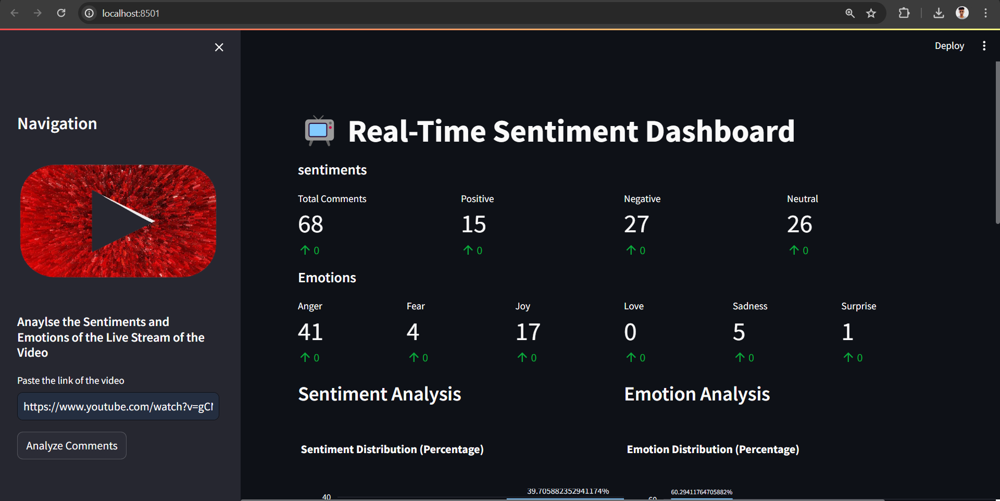

# YouTube Live Stream Sentiment Analysis Dashboard

This web application provides sentiment analysis and emotion analysis on the live chat comments of a YouTube Live Stream.

## Features

- **Sentiment Analysis**: Analyzes the sentiment of live chat comments and visualizes the distribution.
- **Emotion Analysis**: Analyzes the emotions expressed in live chat comments and visualizes the distribution.
- **Real-time Updates**: Updates the analysis in real-time as new chat comments come in.
- **Interactive Visualization**: Provides interactive charts for better understanding and exploration.

## Technologies Used

- **Streamlit**: Python library for creating interactive web apps.
- **Plotly**: Python library for creating interactive plots and charts.
- **YouTube API**: Utilized for fetching live chat comments from YouTube.
- **Natural Language Toolkit (NLTK)**: Python library for natural language processing tasks.
- **Machine Learning Algorithms**: Utilized machine learning algorithms for sentiment analysis and emotion analysis, including:
  - **Multinomial Naive Bayes**: A probabilistic classifier based on the Bayes theorem.
  - **Logistic Regression**: A linear model for binary classification.
  - **Decision Trees**: Tree-like models of decisions.
  - **Random Forest**: Ensemble learning method for classification and regression.
- **Ensemble Learning**:
  - **Hard Voting**: Combines the predictions of multiple classifiers and selects the class with the most votes.
  - **Soft Voting**: Combines the predicted probabilities of multiple classifiers and selects the class with the highest average probability.
  - **Stacking Classifiers**: Combines the predictions of multiple classifiers using a meta-classifier.

## Deployment

The app is deployed on Streamlit Cloud. You can access it [here](https://youtubelivestreamsentimentdashbording.streamlit.app/).

## Usage

1. **Input**: Paste the link of the YouTube live stream in the text input box.
2. **Sentiment Analysis**: See the distribution of sentiment in live chat comments.
3. **Emotion Analysis**: See the distribution of different emotions expressed in live chat comments.
4. **Real-time Updates**: The analysis updates automatically as new chat comments are received.

## Example

## Installation

To run the app locally, follow these steps:

1. Clone this repository:

